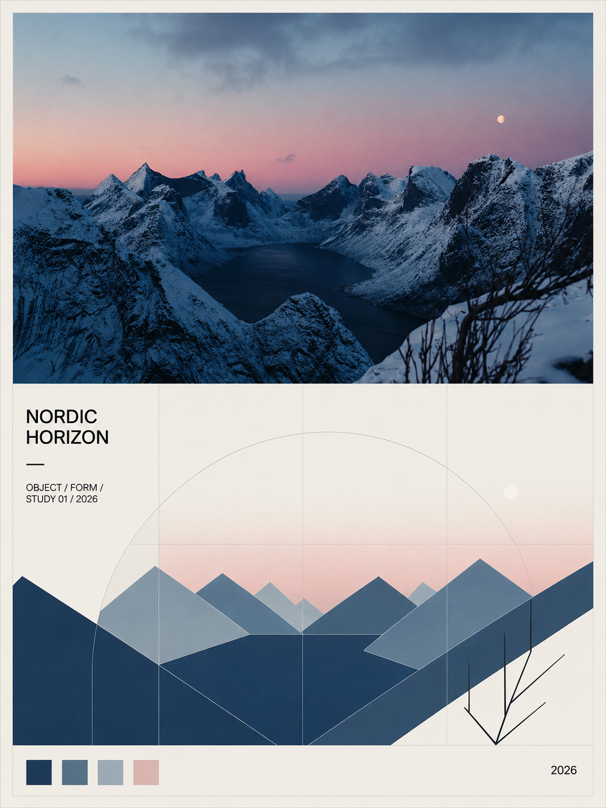

# Swiss Poster Composer

> 将每张上传照片独立转译为 3:4 竖版、上下约 1:1 的 Swiss International Style 摄影海报。

[打开视觉主页](./index.html) · [阅读完整 Skill](./SKILL.md)

> **星野AI聚合网站**  
> 汇集 AI 工具与服务入口，访问 [xyhub666.com](https://xyhub666.com/) 继续探索。

## 平级的水彩艺术海报 Skill

水彩 / 墨彩艺术海报已整理为独立仓库，不属于本 Swiss 仓库：[Fine Art Poster Translator GitHub](https://github.com/hellsing198309-wq/fine-art-poster-translator) · [在线视觉主页](https://hellsing198309-wq.github.io/fine-art-poster-translator/)。



## 这是什么

Swiss Poster Composer 是一个面向图像生成模型的视觉 Skill。它把一张真实照片拆成两种互相对应的语言：

- 上半部保留原照片主体与环境氛围，采用与主体匹配的建筑、风景、人物、静物或动物 Editorial Photography 与美术馆档案摄影的影调标准。
- 下半部从同一主体的轮廓、透视、重复节奏、阴影、比例和方向中提取结构，再转译为矩形、圆形、半圆、细线和模块化网格。

重点不是给照片套上一个“瑞士风”滤镜，而是让摄影与抽象共享一套可解释的结构关系。参考效果的版式包括：米白纸张边距、上半部原图摄影、下半部米白抽象地面、低对比度网格、主体轮廓色块、左侧标题与元信息、底部色板和右下年份。

## 核心规则

| 规则 | 要求 |
| --- | --- |
| 独立输出 | 每张上传照片单独生成一张完整海报；不合并照片，不共用抽象方案 |
| 画幅 | 3:4 竖版 |
| 分区 | 上下约 1:1，上半部摄影，下半部抽象 |
| 原图保留 | 上半部必须使用当前照片作为主体来源，不得替换成另一张相似场景 |
| 抽象逻辑 | 下半部必须能回溯到当前照片的结构特征 |
| 网格 | 全画面共用 Swiss Grid System 与基线逻辑 |
| 色彩 | 从照片提取 2–4 个核心色，加米白与灰黑，控制在 5–6 色以内 |
| 文字 | 极少、左对齐、现代无衬线；无法可靠渲染时不输出乱码 |

## 快速使用

1. 将 `SKILL.md` 放入你的 Skill 目录。
2. 上传一张照片并调用 `$swiss-poster-composer`。
3. 多张照片请逐张调用，确保每张图都有独立的主体分析、配色和几何转译。
4. 如需改变标题、主色或抽象程度，在默认调用后追加明确指令即可。

推荐的最短调用方式：

```text
使用 $swiss-poster-composer，将这张照片保留主体并转译成一张 3:4 的 Swiss International Style 摄影海报。
```

## 默认调用模板

```text
请将这张上传照片独立制作成一张 Swiss International Style 瑞士国际主义摄影海报。

每张上传照片必须单独生成一张完整海报；不要合并照片，也不要让不同照片共用同一套抽象图形。

画面采用 3:4 竖版，上下区域严格保持约 1:1，并在全画面使用统一的 Swiss Grid System。

上半部完整保留当前上传照片的主体、空间关系与环境氛围；下半部只从主体的轮廓、透视、重复节奏、阴影、比例和方向中提取结构，转译为几何块、矩形、圆形、半圆、细线与模块化网格。

从当前照片提取 2–4 个核心颜色，并加入米白与灰黑。文字极少，左对齐，使用现代无衬线字体。不得替换原图主体，不得随机拼贴，不得输出无关场景或乱码文字。
```

## 视觉基准与正式示例

以下 5 张图片来自用户昨天生成的成品，作为本 Skill 的正式视觉样本。它们证明同一套版式可以适配建筑观察、人物动态、汽车与夕阳、动物肖像和建筑场景。

| 示例 | 摄影主体 | 抽象线索 |
| --- | --- | --- |
| [VIEW / OBSERVATION](./assets/view-observation.png) | 城市天际线与观景者 | 建筑拱顶、塔楼、圆形观察点 |
| [GRACE / FORM](./assets/grace-form.png) | 草地上的舞者 | 人体姿态、裙摆曲线、水平色带 |
| [SUNSET / FORM](./assets/sunset-form.png) | 夕阳下的老爷车与情侣 | 车身、车轮、人物柱体与太阳 |
| [FOCUS / INSTINCT](./assets/focus-instinct.png) | 草丛中的黑猫 | 耳朵、眼睛、草叶线条与竖向色柱 |
| [ARCHITECTURAL FOCUS](./assets/architectural-focus.png) | 城堡塔楼与观察者 | 屋顶三角、塔体矩形、拱门与圆点 |

这些图片不是要被固定复制到新输出中；它们定义的是共同的视觉语法。每次调用仍必须从当前上传照片提取主体轮廓、动作、阴影与颜色。

## 包结构

```text
swiss-poster-composer/
├── SKILL.md                 # 完整规则、流程与调用模板
├── README.md                # 项目说明与快速使用
├── index.html               # GitHub Pages 视觉主页
├── styles.css               # Swiss Grid 主页样式
├── agents/
│   └── openai.yaml          # Skill 展示名称与默认调用提示
└── assets/
    ├── reference-nordic-horizon.png
    ├── view-observation.png
    ├── grace-form.png
    ├── sunset-form.png
    ├── focus-instinct.png
    └── architectural-focus.png
```

## 追加调整

可以追加以下指令，而不改变 Skill 的核心约束：

- “标题改为 `LIGHT / VOLUME`。”
- “抽象区减少圆形，只保留矩形、斜线和细网格。”
- “从原图提取蓝灰与锈红，降低黄色比例。”
- “不显示任何文字，但保留左下角网格留白。”

无论怎样调整，都要继续保持：原图主体、单图独立输出、3:4、上下约 1:1、结构对应与 Swiss Grid。
